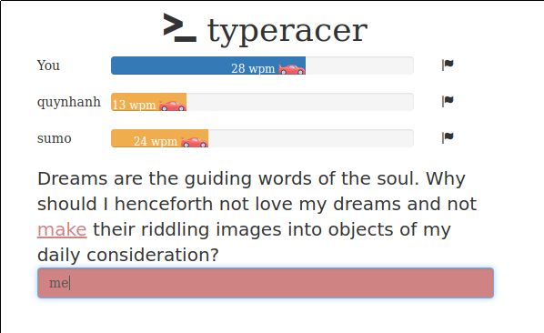

A [TypeRacer](http://play.typeracer.com/) clone with simple matchmaking mechanism.



**Backend**: Akka, Akka Http WebSocket, Reactive Streams.
```
> sbt run
INFO  [type-racer]: Server is listening on port 5000. ENTER to quit
```

**Frontend**: Angular 2, Typescript.
```
> cd frontend
> npm install
> ng serve
** NG Live Development Server is running on http://localhost:4200. **
```

Racecar Icon made by [Freepik](http://www.flaticon.com/authors/freepik) from www.flaticon.com
